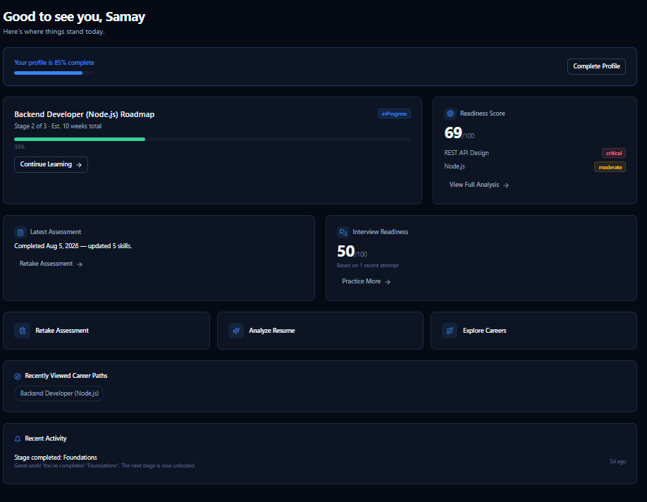
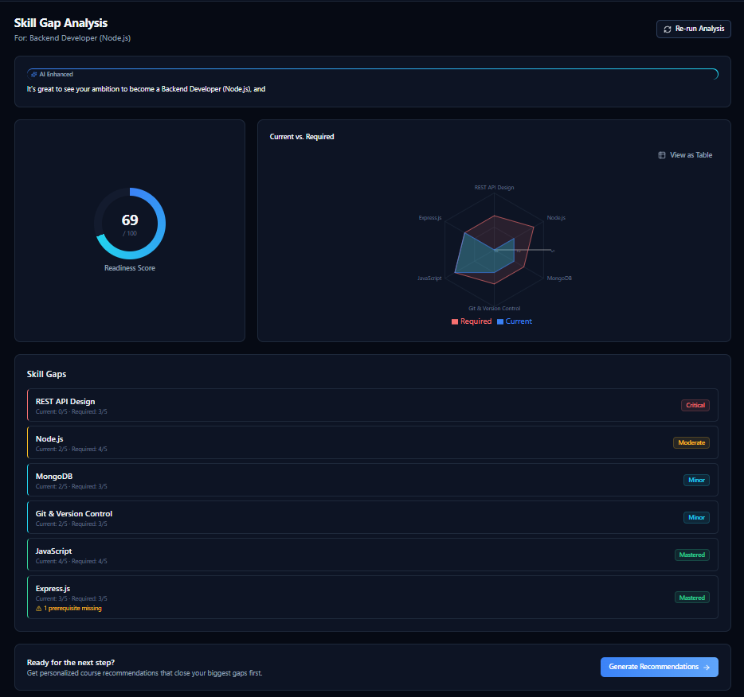
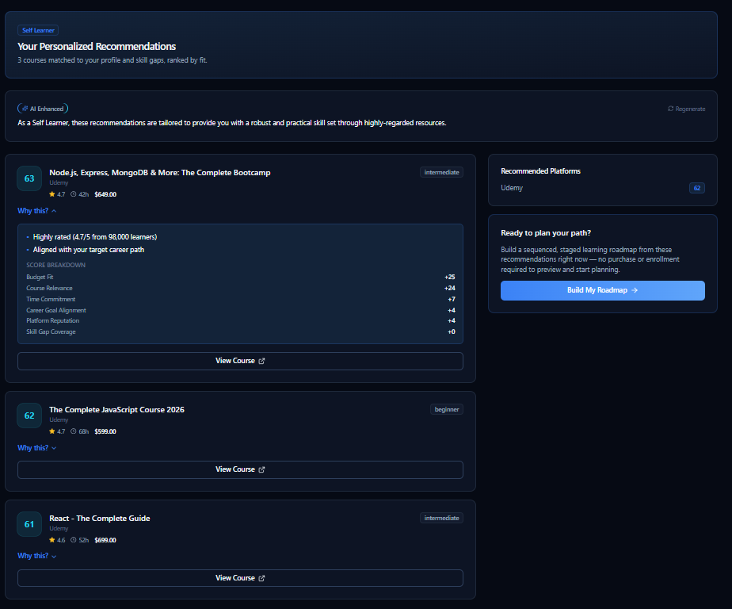
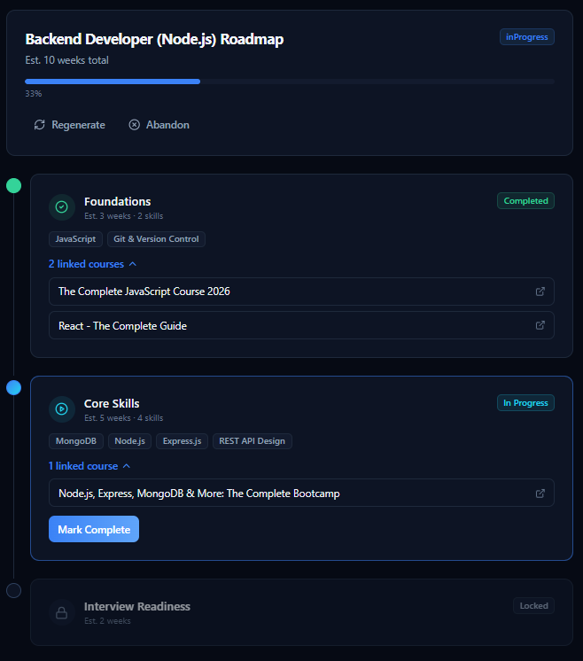
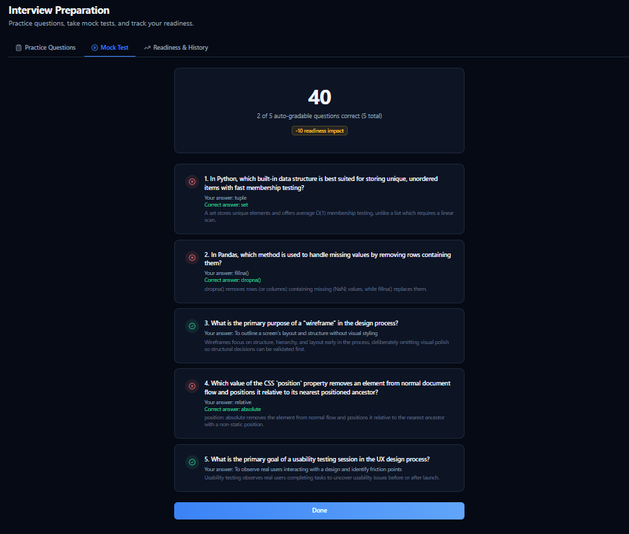
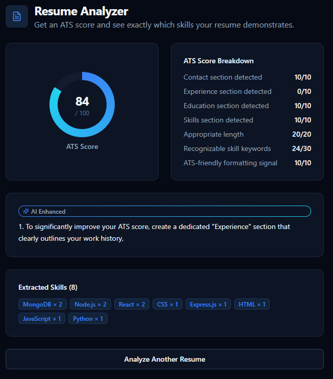
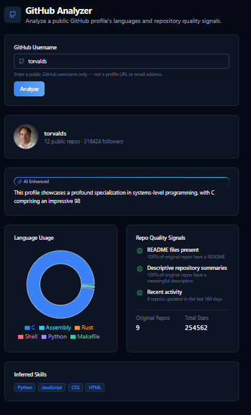
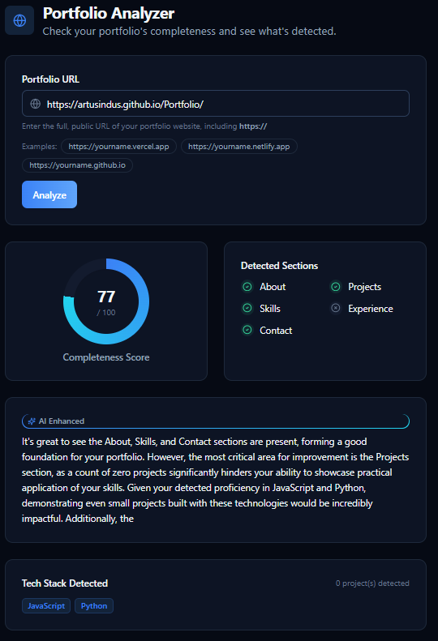

# CareerPath – Career Recommendation & Learning Platform

## Overview

CareerPath is a full-stack web platform that helps people figure out what to learn next in their career. You pick a career goal, take a short skill assessment, and the platform tells you exactly which skills you're missing, recommends real courses to close those gaps, and builds you a step-by-step learning roadmap.

Most of the platform runs on plain rule-based logic (not AI) — skill gap scoring, course recommendations, and roadmap generation are all deterministic and explainable. There's also an optional AI module that can add short natural-language explanations on top of these results, but the platform works completely fine without it.



## Main Features

- **Authentication** – register, login, forgot/reset password, secure sessions
- **Profile management** – education, current role, skills, interests, budget preference, resume upload
- **Career Explorer** – browse career paths and see exactly which skills each one needs
- **Skill Assessment** – a short quiz that estimates your current skill levels
- **Skill Gap Analysis** – compares your skills against a target career and gives you a readiness score (0-100) with a breakdown of what's missing



- **Course Recommendations** – ranks real courses based on your skill gaps, budget, and background, and explains why each one was picked



- **Learning Roadmap** – turns your recommendations into a staged, step-by-step plan that unlocks as you complete each stage



- **Course Explorer & Comparison** – search courses, compare up to 4 side by side
- **Platform Comparison** – compare learning platforms (Coursera, Udemy, etc.) side by side
- **Interview Preparation** – practice questions and timed mock tests, with a readiness score based on your results



- **Resume Analyzer** – uploads a resume and gives an ATS-style score plus detected skills



- **GitHub Analyzer** – analyzes a public GitHub profile's languages and repo quality



- **Portfolio Analyzer** – checks a personal portfolio site for completeness



- **Notifications** – get notified when an assessment, recommendation, resume analysis, or interview attempt is completed
- **Dashboard** – one page showing your progress, readiness score, active roadmap, and recent activity
- **Admin Panel** – for managing users, courses, skills, career paths, interview questions, and feature flags
- **Optional AI module** – adds short AI-written explanations to some results (see AI Module section below)


## How the Platform Works

1. Sign up and complete your profile (education, interests, budget, etc.)
2. Take the skill assessment
3. Pick a target career from the Career Explorer
4. Run a Skill Gap Analysis to see your readiness score and what's missing
5. Get personalized course recommendations
6. Generate a learning roadmap from those recommendations
7. Work through the roadmap stage by stage, tracking progress
8. Use the analyzer tools and interview prep along the way

## Technology Stack

- **Frontend:** React 18, Vite, Tailwind CSS, Redux Toolkit, React Router
- **Backend:** Node.js, Express, MongoDB, Mongoose
- **AI Module (optional):** Python, FastAPI

## Project Structure

frontend/ → React app (pages, components, API calls)
backend/ → Express API, MongoDB models, business logic
ai-service/ → Optional Python AI service


## Setup and Installation

You'll need Node.js, MongoDB, and (optionally) Python installed.

```bash
git clone <your-repo-url>
cd <project-folder>

# backend
cd backend
npm install

# frontend
cd ../frontend
npm install
```

## Environment Variables

Both `backend` and `frontend` need a `.env` file (see each folder's own README for the exact list). Never commit real secrets — use placeholders like:

MONGO_URI=YOUR_MONGO_URI
JWT_ACCESS_SECRET=YOUR_JWT_SECRET


## Running the Project

```bash
# terminal 1 — backend
cd backend
npm run dev

# terminal 2 — frontend
cd frontend
npm run dev
```

Then open the frontend URL shown in your terminal (usually `http://localhost:5173`).

## AI Module

The AI module is completely optional. The full platform — skill gap analysis, recommendations, roadmap, all analyzer tools — works normally without it. If you set it up, it adds short AI-generated explanations on top of a few features (like a plain-language summary of your skill gap results). If it's not running, those features just skip the extra explanation and everything else works the same. See `ai-service/README.md` for setup.

## Future Improvements

- More career paths and a bigger interview question bank
- Nicer mobile experience in a few remaining spots
- Maybe a course purchase/enrollment flow down the line

## Notes

This is a personal/student project built to practice full-stack development. Feel free to look around the code.
